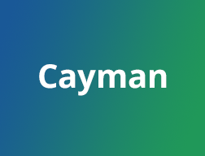

This site uses the Cayman theme

[](https://github.com/pages-themes/cayman/actions/workflows/ci.yaml) [](https://badge.fury.io/rb/jekyll-theme-cayman)

*Cayman is a Jekyll theme for GitHub Pages. You can [preview the theme to see what it looks like](http://pages-themes.github.io/cayman), or even [use it today](#usage).*



# Add a new edition

Create a folder `/year` and have the `/year/index.md` with the preamble
```
---
layout: year
permalink: /year/
---
```
Then update the root's `/index.html` to redirect to the new edition.


For other md files in the new edition's folder, such as `/year/program.md`, use the preamble
```
---
layout: year
permalink: /year/program
---
```

Also, copy one of the older layouts, such as `_layouts/2026.html`, to `_layouts/year.html` and edit the paths in the menu (so that instead of `/2026/...` they look like `/year/...`).

Also, generate a version of the logo for the new year and have it in assets, your new layout should point to it. 

Last, but usefully, have something like the following in your `/year/index.md` file:
```markdown
Previous editions of UncertaiNLP: [2024](/2024), [2025](/2025), [2026](/2026)
```

Note that paths should always use permlinks, eg `[program](/2026/program)`, and they should start from `/`, not from `./`.
