Welcome to the website of the second **UncertaiNLP** workshop to be held at [EMNLP 2025](https://2025.emnlp.org) in Suzhou, China.

*Tagline:* UncertaiNLP brings together researchers embracing sources of uncertainty from human language and NLP tools; harnessing them for improved NLP.

Previous editions of UncertaiNLP: [2024](/2024).

**Update 18/07:** We have moved the submission deadlines and subsequent review schedule forward by a week! 

## Important Dates
- **First call for papers:** June 6th, 2025
- **Second call for papers:** July 1st, 2025
- **Third call for papers:** August 1st, 2025
- **Submission deadline:** ~~August 8th, 2025~~ August 15th, 2025
- **Submission of already pre-reviewed ARR papers:** ~~August 22nd, 2025~~ August 29th, 2025
- **Notification of acceptance:** ~~September 10th, 2025~~ September 17th, 2025
- **Camera-ready papers due:** ~~September 14th, 2025~~ September 21st, 2025
- **Workshop date:** November 9th, 2025

All deadlines are 11:59pm UTC-12 ("anywhere on earth"). 

## Workshop Topic and Content

Human languages are inherently ambiguous and understanding language input is subject to interpretation and complex contextual dependencies. Nevertheless, the main body of research in NLP is still based on the 
assumption that ambiguities and other types of underspecification can and have to be resolved. This workshop will provide a platform for research that embraces variability in human language and aims to represent and evaluate the uncertainty that arises from it, and from modeling tools themselves.

### Workshop Topics

UncertaiNLP welcomes submissions to topics related (but not limited) to:

<!-- - *Frameworks for uncertainty representation* -->
- *Formal tools for uncertainty representation*
  - Theoretical work on probability and its generalizations
  - Symbolic representations of uncertainty

- *Documenting sources of uncertainty*
  - Theoretical underpinnings of linguistic sources of variation
  - Data collection (e.g., to document linguistic variability, multiple perspectives, etc.)
 
- *Modeling*
  - Explicit representation of model uncertainty (e.g., parameter and/or hypothesis uncertainty, Bayesian NNs in NLU/NLG, verbalised uncertainty, feature density, external calibration modules)
  - Disentangled representation of different sources of uncertainty (e.g., hierarchical models, prompting)
  - Reducing uncertainty due to additional context (e.g. clarification questions, retrieval/API augmented models)

- *Learning (or parameter estimation)*
  - Learning from single and/or multiple references
  - Gradient estimation in latent variable models
 
- *Probabilistic inference*
  - Theoretical and applied work on approximate inference (e.g., variational inference, Langevin dynamics)
  - Unbiased and asymptotically unbiased sampling algorithms
 
- *Decision making*
  - Utility-aware decoders and controllable generation
  - Selective prediction
  - Active learning

- *Evaluation*
  - Statistical evaluation of language models
  - Calibration to interpretable notions of uncertainty (e.g., calibration error, conformal prediction)
  - Evaluation of epistemic uncertainty

- *Hallucinations*
  - Theoretical and empirical study of hallucination phenomena in NLU/NLG
  - Describing, formalising, categorising hallucination phenomena  
  - Methods for detecting and quantifying hallucinations
  - Mitigation techniques including uncertainty-aware generation, retrieval-augmented methods, and controllable generation
  - Relationship between specific kinds (or sources) of uncertainty and hallucination occurrence

 
<table cellspacing="0" cellpadding="0">
  <tr>
    <td>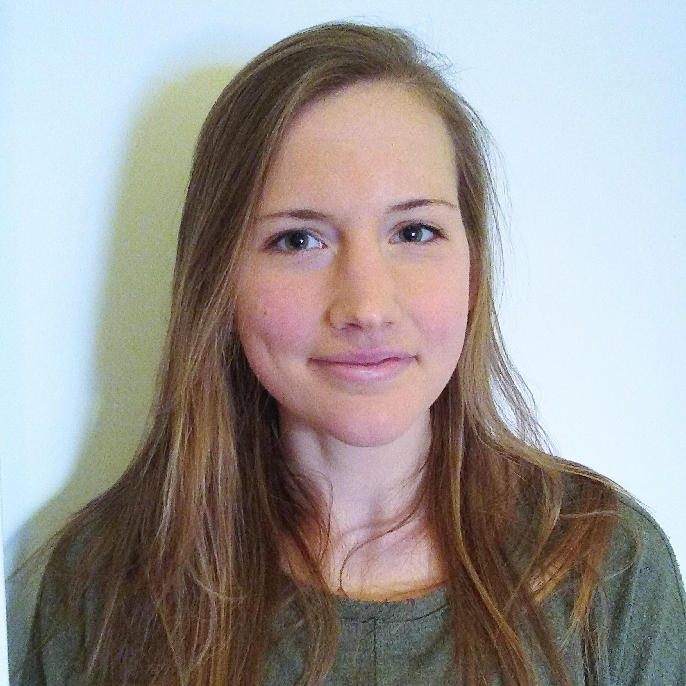</td>
    <td>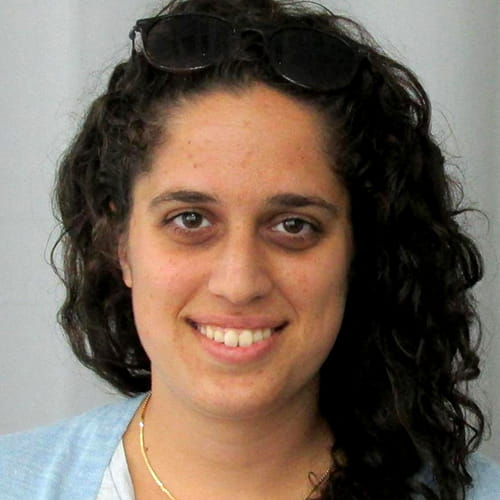</td>
    <td>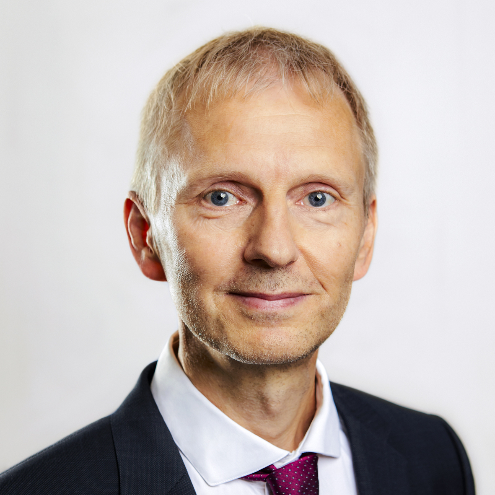</td>
  </tr>
  <tr>
    <td><figcaption font-size=10px word-wrap="break-word" width="360" height="auto">Clara Meister (ETH Zürich, CH)</figcaption> </td>
    <td><figcaption font-size=10px word-wrap="break-word" width="360" height="auto">Gal Yona (Google Research, IL)</figcaption> </td>
    <td><figcaption font-size=10px word-wrap="break-word" width="360" height="auto">Eyke Hüllermeier (LMU Münich, DE)</figcaption> </td>
  </tr>
</table>

## Call for Papers
Authors are invited to submit by August 15th original and unpublished research papers in the following categories:

- Full papers (up to 8 pages) for substantial contributions.
- Short papers (up to 4 pages) for ongoing or preliminary work.

All submissions must be in PDF format, submitted electronically via [OpenReview](https://openreview.net/group?id=EMNLP/2025/Workshop/UncertaiNLP) and should follow the EMNLP 2025 formatting guidelines (following the [ARR CfP](https://aclrollingreview.org/cfp): use the official ACL style templates, which are available [here](https://github.com/acl-org/acl-style-files)).

We now accept submissions with already existing ACL Rolling Reviews (ARR) via [OpenReview](https://openreview.net/group?id=EMNLP/2025/Workshop/UncertaiNLP_ARR_Commitment), with the deadline August 29th AoE. These submissions must have been reviewed by ARR before, which will be used in our evaluation, and which must be linked to our system through the **paper link** field available in the OpenReview form. Please make sure to also follow the EMNLP 2025 formatting guidelines (following the [ARR CfP](https://aclrollingreview.org/cfp): use the official ACL style templates, which are available [here](https://github.com/acl-org/acl-style-files)).

All submissions are archival, but we also invite authors of papers accepted to Findings to reach out to the organizing committee of UncertaiNLP to present their papers at the workshop, if in line with the topics described above.

Camera-ready versions for accepted archival papers should be uploaded to the submission system by the camera-ready deadline. Authors may use up to one (1) additional page to address reviewer comments.

Call for Papers is available [here](/cfp).

## Program Committee
- Luigi Acerbi (University of Helsinki, FI)
- Roee Aharoni (Google Research, IL)
- Joris Baan (University of Amsterdam, NL)
- Samuel Barry (Mistral AI, US)
- Alexandra Bodrova (Princeton University, US)
- Margarida M. Campos (Instituto de Telecomunicações, Instituto Superior Técnico, PT)
- Julius Cheng (University of Cambridge, UK)
- Caio Corro (INSA Rennes, FR)
- Nico Daheim (Technische Universität Darmstadt, DE)
- António Farinhas (Instituto Superior Técnico, PT)
- Raquel Fernandez (University of Amsterdam, NL)
- Jes Frellsen (Technical University of Denmark, DK)
- Taisiya Glushkova (Instituto Superior Técnico, PT)
- Christian Hardmeier (IT University Copenhagen, DK)
- Evgenia Ilia (University of Amsterdam, NL)
- Yuu Jinnai (CyberAgent, Inc., JP)
- Haau-Sing Li (Technische Universität Darmstadt, DE)
- Timothee Mickus (University of Helsinki, FI)
- Laura Perez (University of Edinburgh, UK)
- Natalie Schluter (Technical University of Denmark, DK)
- Philip Schulz (Amazon, AU)
- Sebastian Schuster (University College London, University of London, UK)
- Rico Sennrich (University of Zürich, CH)
- Anthony Sicilia (Northeastern University, US)
- Edwin Simpson (University of Bristol, UK)
- Aman Sinha (University of Lorraine, FR)
- Arno Solin (Aalto University, FI)
- Dharmesh Tailor (University of Amsterdam, NL)
- Aarne Talman (University of Helsinki, FI)
- Ivan Titov (University of Edinburgh, UK)
- Dennis Ulmer (IT University Copenhagen, Technical University of Denmark (DTU), DK)
- Teemu Vahtola (University of Helsinki, FI)
- Sami Virpioja (University of Helsinki, FI)
- Andreas Vlachos (University of Cambridge, UK)
- Yuxia Wang (Mohamed bin Zayed University of Artificial Intelligence, AE)

<!--- ## Workshop Organizers -->

<table class="organizer-table" cellspacing="0" cellpadding="0">
  <tr>
    <td></td>
    <td>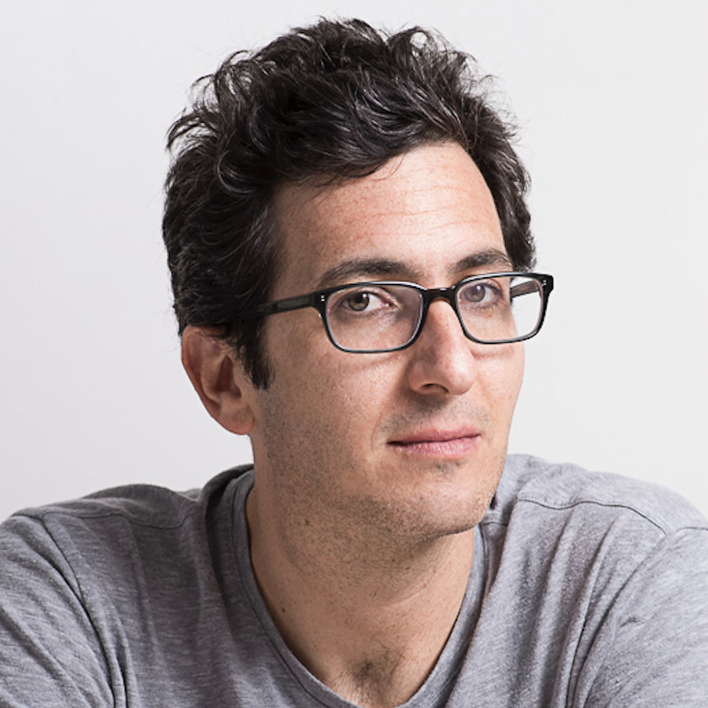</td>
    <td>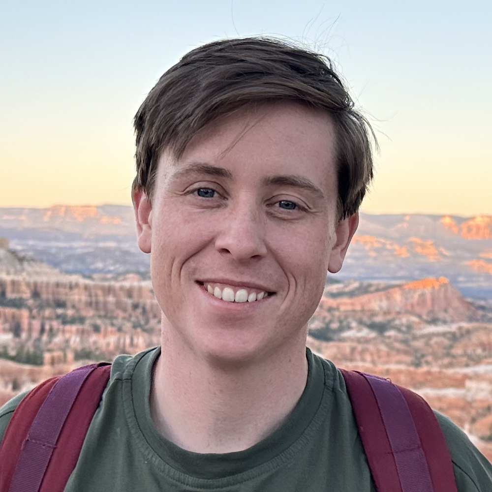</td>
    <td></td>
    <td></td>
  </tr>
  <tr>
    <td><figcaption><a href="https://wilkeraziz.github.io/">Wilker Aziz, University of Amsterdam</a></figcaption></td>
    <td><figcaption><a href="https://www.cs.tau.ac.il/~joberant/">Jonathan Berant, Tel Aviv University and Google Deepmind</a></figcaption></td>
    <td><figcaption><a href="https://bryaneikema.com">Bryan Eikema, University of Amsterdam</a></figcaption></td>
    <td><figcaption><a href="https://cental.uclouvain.be/team/mcdm/">Marie-Catherine de Marneffe, UCLouvain and FNRS</a></figcaption></td>
    <td><figcaption><a href="https://bplank.github.io/">Barbara Plank, LMU Münich and IT University of Copenhagen</a></figcaption></td>
  </tr>
</table>
<table class="organizer-table" cellspacing="0" cellpadding="0" style="margin-top: 20px">
  <tr>
    <td>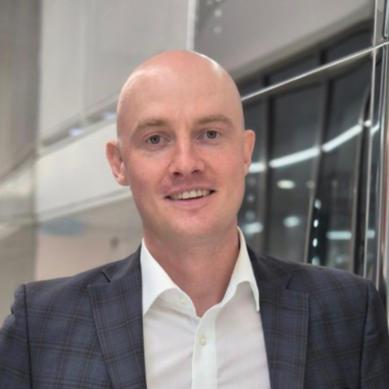</td>
    <td></td>
    <td></td>
    <td>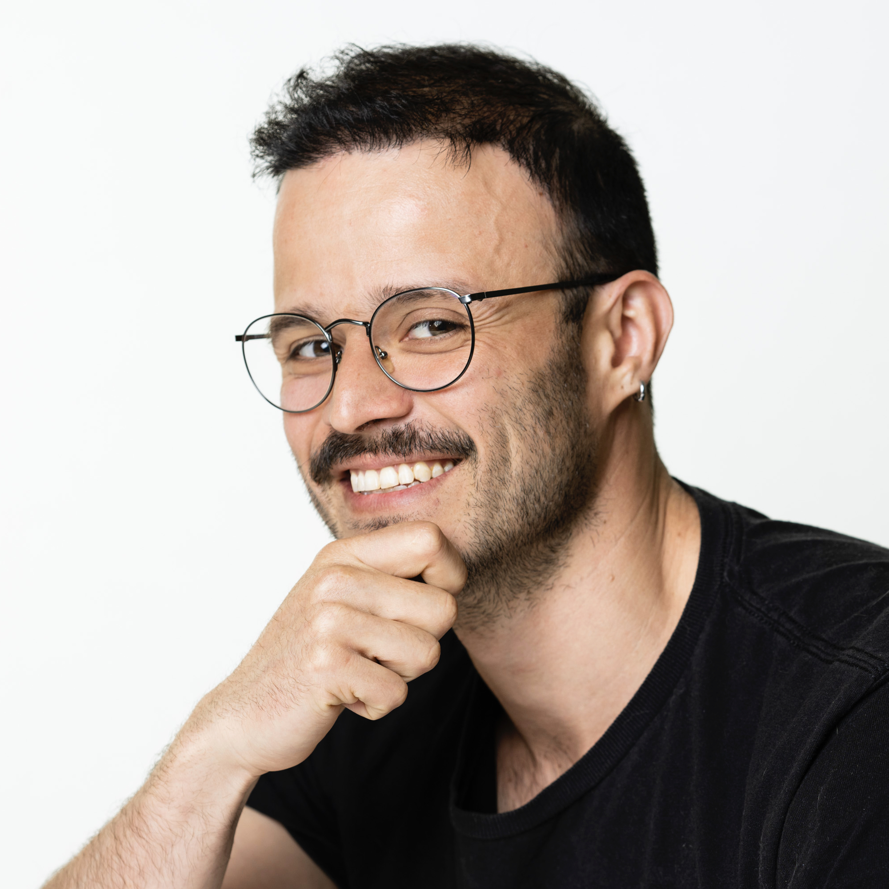</td>
    <td>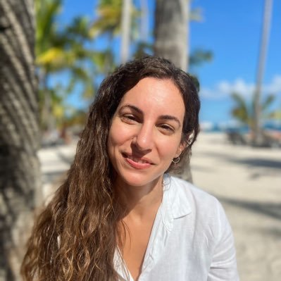</td>
  </tr>
  <tr>
    <td><figcaption><a href="https://scholar.google.ru/citations?user=-zFR1g0AAAAJ">Artem Shelmanov, Mohamed bin Zayed University of Artificial Intelligence</a></figcaption></td>
    <td><figcaption><a href="https://swabhs.com/">Swabha Swayamdipta, USC Viterbi CS</a></figcaption></td>
    <td><figcaption><a href="https://blogs.helsinki.fi/tiedeman/">Jörg Tiedemann, University of Helsinki</a></figcaption></td>
    <td><figcaption><a href="https://jrvc.github.io">Raúl Vázquez University of Helsinki</a></figcaption></td>
    <td><figcaption><a href="https://scholar.google.com/citations?user=S5NGkFsAAAAJ">Chrysoula Zerva, Instituto de Telecomunicaçõ es</a></figcaption></td>
  </tr>
</table>

## Contact
You can contact the organizers by email to [uncertainlp@googlegroups.com](mailto:uncertainlp@googlegroups.com).

## Sponsors
We would like to thank [UTTER](https://he-utter.eu) and [CRAI](https://centerforresponsible.ai) for their support of this workshop.
<table class="sponsor-table" cellspacing="0" cellpadding="0" style="margin-top: 20px;">
  <tr>
    <td>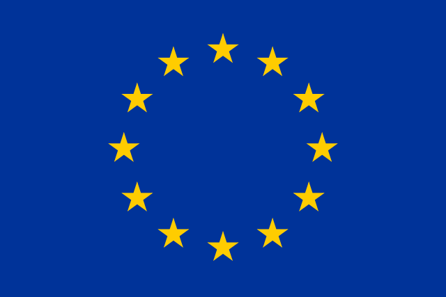</td>
    <td><a href="https://he-utter.eu">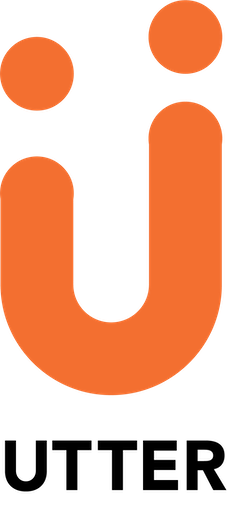</a></td>
    <td><a href="https://centerforresponsible.ai">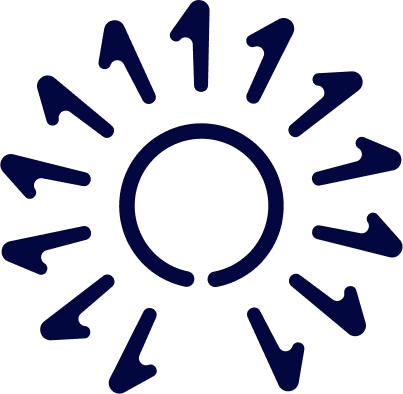</a></td>
  </tr>
</table>

## Anti-Harassment Policy
UncertaiNLP workshop adheres to the [ACL’s code of ethics](https://www.aclweb.org/portal/content/acl-code-ethics), [ACL’s anti-harassment 
policy](https://www.aclweb.org/adminwiki/index.php?title=Anti-Harassment_Policy) , and [ACL’s code of conduct](https://2024.eacl.org/code/). 

## Image Credits

Images were created using text-to-image model supplied via [getimg.ai/](https://getimg.ai/text-to-image), using the [CreativeML Open Rail-M license](https://huggingface.co/spaces/CompVis/stable-diffusion-license).
