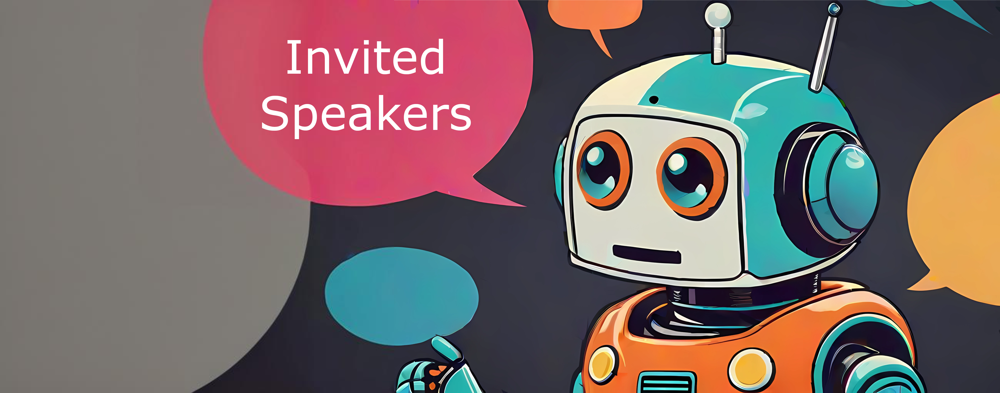
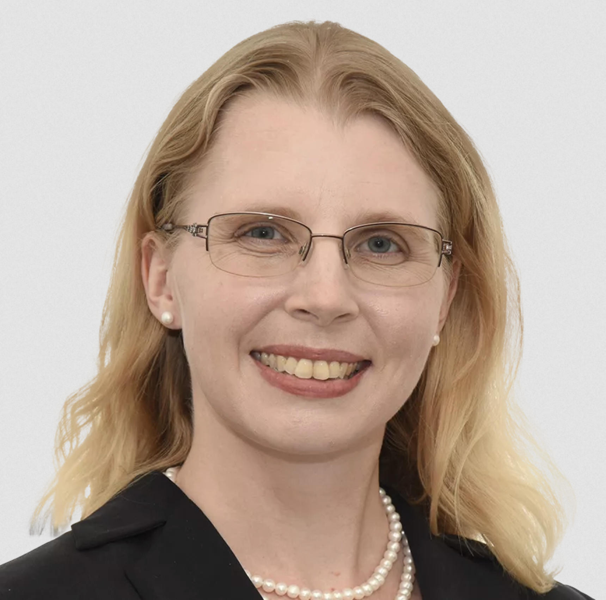
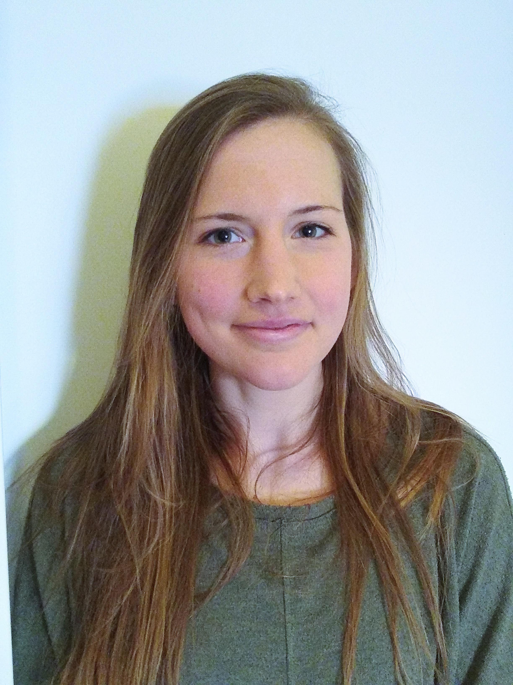
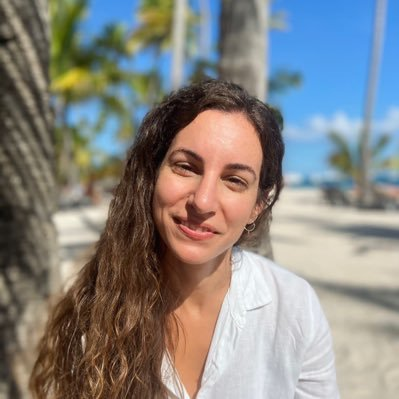
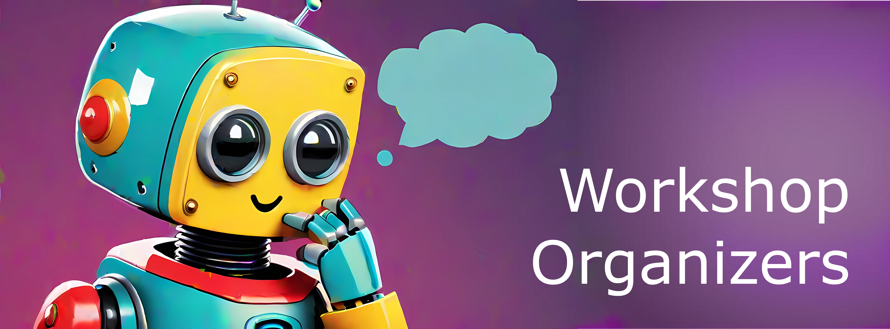
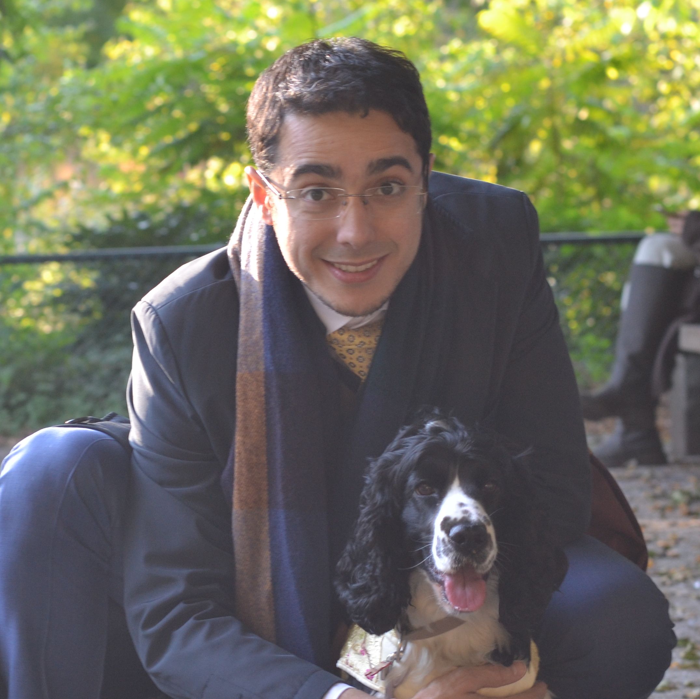
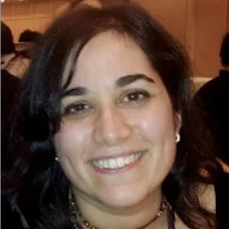
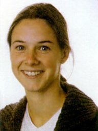
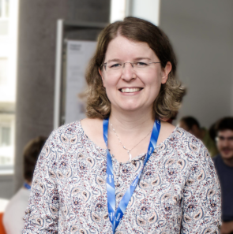
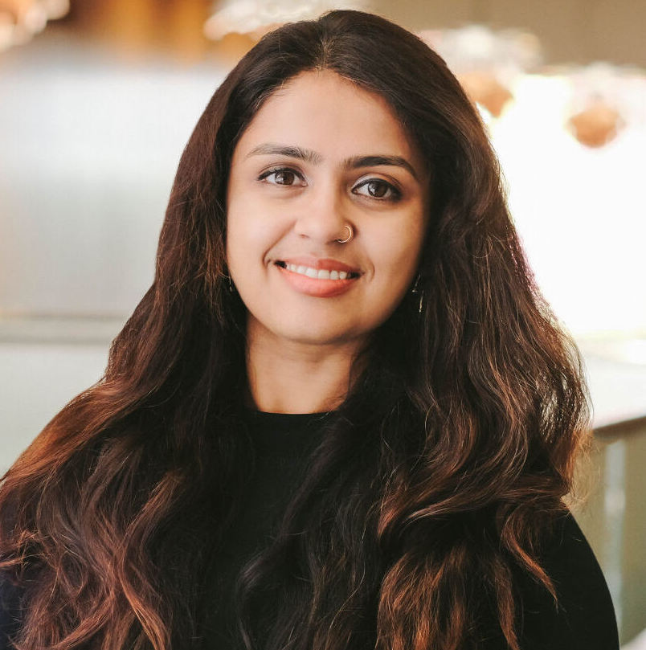

<!-- # First Workshop on Uncertainty-Aware NLP @EACL 2024 -->
/ HOME / [CALL FOR PAPERS](/#call-for-papers) / [PROGRAM COMMITTEE](https://uncertainlp.github.io/#program-committee) / [PROGRAM](/program) / [CONTACT](https://uncertainlp.github.io/#contact) /

Welcome to the website of the **UncertaiNLP** workshop to be held at [EACL 2024 in Malta](https://2024.eacl.org/).

*Tagline:* UncertaiNLP brings together researchers embracing sources of uncertainty from human language and NLP tools; harnessing them for improved NLP.

## Important Dates
- ~~**First call for papers:** October 20, 2023~~
- ~~**Second call for papers:** November 15, 2023~~
- ~~**Third call for papers:** December 11 , 2023~~
- ~~**Submission deadline:** December 22, 2023~~
- ~~**Submission of already pre-reviewed ARR papers:** January 20, 2024~~
- ~~**Notification of acceptance:** January 20, 2024~~
- ~~**Camera-ready papers due:** January 30 2024~~
- **Workshop date:** March 22, 2024

All deadlines are 11:59pm UTC-12 ("anywhere on earth").

## Workshop Topic and Content

Human languages are inherently ambiguous and understanding language input is subject to interpretation and complex contextual dependencies. Nevertheless, the main body of research in NLP is still based on the 
assumption that ambiguities and other types of underspecification can and have to be re-solved. This workshop will provide a platform for research that embraces variability in human language and aims to 
represent and evaluate the uncertainty that arises from it, and from modeling tools themselves.

### Workshop Topics

UncertaiNLP welcomes submissions to topics related (but not limited) to:

- *Frameworks for uncertainty representation*
  - Theoretical work on probability and its generalizations
  - Symbolic representations of uncertainty
- *Documenting sources of uncertainty*
  - Theoretical underpinnings of linguistic sources of variation
  - Data collection (e.g., to to document linguistic variability, multiple perspectives, etc.)
 
- *Modeling*
  - Explicit representation of model uncertainty (e.g., parameter and/or hypothesis uncertainty, Bayesian NNs in NLU/NLG, verbalised uncertainty, feature density, external calibration modules)
  - Disentangled representation of different sources of uncertainty (e.g., hierarchical models, prompting)
  - Reducing uncertainty due to additional context (e.g., additional context, clarification questions, retrieval/API augmented models)

- *Learning (or parameter estimation)*
  - Learning from single and/or multiple references
  - Gradient estimation in latent variable models
 
- *Probabilistic inference*
  - Theoretical and applied work on approximate inference (e.g., variational inference, Langevin dynamics)
  - Unbiased and asymptotically unbiased sampling algorithms
 
- *Decision making*
  - Utility-aware decoders and controllable generation
  - Selective prediction
  - Active learning
    
- *Evaluation*
  - Statistical evaluation of language models
  - Calibration to interpretable notions of uncertainty (e.g., calibration error, conformal prediction)
  - Evaluation of epistemic uncertainty

### Workshop Schedule 

The workshop will take place March 22, 2024 at the Bastion 2 room of the <a href="https://maps.app.goo.gl/Mq8zQciGEe6wnnDZ8">Corinthia St George's Bay hotel</a>.
The [detailed program is available here](/program) and an overview of the schedule is given below:

- 09:00 - 09:10: Opening remarks
- 09:10 - 09:55: Invited Talk - Chrysoula Zerva
- 09:55 - 10:15: Paper spotlight session 1
- 10:15 - 10:30: Lightening paper presentations
- 10:30 - 11:00: Coffee Break
- 11:00 - 12:15: In-person poster session (Corinthia St George's Bay, Terrace Suite)
- 12:15 - 13:15: Lunch break
- 13:15 - 14:00: Invited Talk - Clara Meister
- 14:00 - 15:30: Paper presentations
- 15:30 - 16:00: Coffee Break
- 16:00 - 16:15: Paper spotlight session 2
- 16:15 - 16:30: Paper spotlight session 3
- 16:30 - 17:15: Invited talk - Kristin Lennox
- 17:15 - 17:30: Closing remarks

 
<!-- ## Invited Speakers -->

<table cellspacing="0" cellpadding="0">
  <tr>
    <td></td>
    <!--  <td></td> -->
    <td></td>
    <td></td>
  </tr>
  <tr>
    <td><figcaption font-size=10px word-wrap="break-word" width="360" height="auto">Kristin Lennox (Exponent, US)</figcaption> </td>
    <!--  <td><figcaption font-size=10px word-wrap="break-word" width="360" height="auto">Mohit Bansal (UNC Chapel Hill, US)</figcaption> </td> -->
    <td><figcaption font-size=10px word-wrap="break-word" width="360" height="auto">Clara Meister (ETH Zürich, Switzerland)</figcaption> </td>
    <td><figcaption font-size=10px word-wrap="break-word" width="360" height="auto">Chrysoula Zerva (Instituto Superior Tecnico, Portugal)</figcaption> </td>
  </tr>
</table>

**Kristin Lennox** is a consultant at Exponent with more than ten years of experience applying statistics, machine learning, and operations research techniques to scientific and engineering problems. Dr. Lennox received her Ph.D. in statistics from Texas A&M University in 2010. She then joined Lawrence Livermore National Laboratory, where she cofounded and served as the first director of their internal statistical consulting service. After leaving the laboratory she spent several years in the software industry with a focus on AI in industrial settings, and she currently serves as a consultant regarding statistics and AI implementation for applications in many areas, including environmental science, automotive and consumer product risk, and software. Her expertise includes experimental design, analysis of computer experiments, and risk assessment in high consequence environments. Dr. Lennox’s recent professional experience has focused on methods to characterize safety benefits of advanced driver assistance systems (ADAS) and automated driving. Dr. Lennox is passionate about statistics and AI education and has created a series of videos for technical and lay audiences on these topics.

<!-- **Mohit Bansal** is the John R. & Louise S. Parker Professor and the Director of the MURGe-Lab (UNC-NLP Group) in the Computer Science department at University of North Carolina (UNC) Chapel Hill. Prior to this, he was a research assistant professor (3-year endowed position) at TTI-Chicago. He received his PhD from UC Berkeley in 2013 (where he was advised by Dan Klein) and his BTech from IIT Kanpur in 2008. His research expertise is in natural language processing and multimodal machine learning, with a particular focus on grounded and embodied semantics, language generation and Q&A/dialogue, and interpretable and generalizable deep learning. He is a recipient of IIT Kanpur Young Alumnus Award,  DARPA Director's Fellowship, NSF CAREER Award, Google Focused Research Award, Microsoft Investigator Fellowship, Army Young Investigator Award (YIP), DARPA Young Faculty Award (YFA), and outstanding paper awards at ACL, CVPR, EACL, COLING, and CoNLL. He has been a keynote speaker for the AACL 2023 and INLG 2022 conferences. His service includes ACL Executive Committee, ACM Doctoral Dissertation Award Committee, CoNLL Program Co-Chair, ACL Americas Sponsorship Co-Chair, and Associate/Action Editor for TACL, CL, IEEE/ACM TASLP, and CSL journals. -->

**Clara Meister** is a PhD student in Computer Science with Prof. Ryan Cotterell at ETH Zürich, supported by a Google PhD Fellowship. She is passionate about the general application of statistics and information theory to natural language processing. A large portion of her research in the last years has been on natural language generation—specifically, on decoding methods for probabilistic models. Her additional interests within the field of natural language generation include evaluation metrics and the incorporation of uncertainty into decoding methods.

**Chrysoula (Chryssa) Zerva** is an Assistant Professor in Artificial Intelligence at the Instituto Superior Tecnico in Lisbon, Portugal. She is also a member of LUMLIS, the Lisbon ELLIS unit. She obtained her Ph.D. in 2019 from the University of Manchester working on “Automated identification of textual uncertainty” under the supervision of Prof. Sophia Ananiadou. She was subsequently awarded the EPSRC doctoral prize fellowship to study (mis)information propagation in health and science. 
In 2021, she joined the Instituto de Telecomunicações in Lisbon as a post-doc for the DeepSPIN project under the supervision of Prof. André Martins and worked on a range of machine learning and NLP related topics including uncertainty quantification, machine translation and quality estimation.
Beyond core research, she is interested in dissemination of science to the public and keen on promoting women's participation in research and science; she has previously presented in or co-organised events such as the Pint of Science, Women in Localisation and Greek Girls Code.

## Call for Papers
~~Authors are invited to submit by December 18, 2023 original and unpublished research papers in the following categories:~~

- ~~Full papers (up to 8 pages) for substantial contributions.~~
- ~~Short papers (up to 4 pages) for ongoing or preliminary work.~~

~~All submissions must be in PDF format, submitted electronically via [OpenReview](https://openreview.net/group?id=eacl.org/EACL/2024/Workshop/UncertaiNLP) and should follow the EACL 2024 formatting guidelines (following the [ARR CfP](https://aclrollingreview.org/cfp): use the official ACL style templates, which are available [here](https://github.com/acl-org/acl-style-files)).~~

We now accept submissions with already existing ACL Rolling Reviews (ARR) via [OpenReview](https://openreview.net/group?id=eacl.org/EACL/2024/Workshop/UncertaiNLP_ARR_Commitment), with the deadline January 18 AoE. These submissions must have been reviewed by ARR before, which will be used in our evaluation, and which must be linked to our system through the **paper link** field available in the OpenReview form. Please make sure to also follow the EACL 2024 formatting guidelines (following the [ARR CfP](https://aclrollingreview.org/cfp): use the official ACL style templates, which are available [here](https://github.com/acl-org/acl-style-files)).

We also invite authors of papers accepted to Findings to reach out to the organizing committee of UncertaiNLP to present their papers at the workshop, if in line with the topics described above.

Camera-ready versions for accepted archival papers should be uploaded to the submission system by the camera-ready deadline. Authors may use up to one (1) additional page to address reviewer comments.

Call for Papers is available [here]().

## Program Committee
- Luigi Acerbi (University of Helsinki, FI)
<!-- - Caio Corro (Université Paris-Saclay, FR) -->
- Mathias Creutz (University of Helsinki, FI)
- Nico Daheim (TU Darmstadt, DE)
<!-- - Greg Durrett (University of Texas, USA) -->
<!-- - Raquel Fernandez (University Amsterdam, NL) -->
<!-- - Adam Fisch (MIT, USA) -->
- Stella Frank (Copenhagen University, DK)
<!-- - Christian Hardmeier (ITU Copenhagen, DK) -->
- Markus Heinonen (Aalto University, FI)
- Evgenia Ilia (University of Amsterdam, NL)
<!-- - Metod Jazbec (University of Amsterdam, NL)  -->
- Robin Jia (USC, USA) 
<!-- - Nan-Jiang Jiang (Google, USA) -->
<!-- - Anders Johannsen (Apple, UK) -->
- Gabriella Lapesa (GESIS, DE)
<!-- - Haau-Sing Li (TU Darmstadt, DE) -->
- Putra Manggala (University of Amsterday, NL)
- Timothee Mickus (University of Helsinki, FI)
- Eric Nalisnick (Johns Hopkins University, USA)
- Philip Schulz (Amazon, AU)
<!-- - Tal Schuster (Google Research, USA) -->
<!-- - Djamé Seddah (Inria & Université Paris Sorbonne, FR) -->
- Rico Sennrich (University of Zurich, CH & University of Edinburgh, UK)
- Natalie Schluter (Apple, DK)
- Sebastian Schuster (Saarland University, DE)
- Edwin Simpson (University of Bristol, UK)
<!-- - Anders Søgaard (University of Copenhagen, DK) -->
- Arno Solin (Aalto University, FI)
- Dharmesh Tailor (University of Amsterdam, NL)
- Aarne Talman (Silo.ai, FI)
- Ivan Titov (University of Edinburgh, UK)
- Teemu Vahtola (University of Helsinki, FI)
- Raúl Vázquez (University of Helsinki, FI)
<!-- - Andreas Vlachos (University of Cambridge) -->
- Sami Virpioja (Utopia Analytics & University of Helsinki, FI)
- Xinpeng Wang (LMU Munich, DE)
- Leon Weber-Genzel (LMU Munich, DE)
- Roman Yangarber (University of Helsinki, FI)
<!-- - Chrysoula Zerva (Instituto de Telecomunicações & Instituto Superior Técnico, PT) -->
<!-- - Elaine Zosa (Silo.ai, FI) -->

<!--- ## Workshop Organizers -->

<table cellspacing="0" cellpadding="0">
  <tr>
    <td></td>
    <td></td>
    <td></td>
    <td></td>
  </tr>
  <tr>
    <td><figcaption font-size=10px word-wrap="break-word" height="auto"><a href="https://wilkeraziz.github.io/">Wilker Aziz, University of Amsterdam</a></figcaption></td>
    <td><figcaption font-size=10px word-wrap="break-word" height="auto"><a href="https://jorisbaan.nl/">Joris Baan, University of Amsterdam</a></figcaption> </td>
    <td><figcaption font-size=10px word-wrap="break-word" height="auto"><a href="https://researchportal.helsinki.fi/en/persons/hande-celikkanat">Hande Celikkanat, University of Helsinki</a></figcaption> </td>
    <td><figcaption font-size=10px word-wrap="break-word" height="auto"><a href="https://cental.uclouvain.be/team/mcdm/">Marie-Catherine de Marneffe, UCLouvain and FNRS</a></figcaption> </td>
  </tr>
</table>
 
<table cellspacing="0" cellpadding="0">
  <tr>
    <td></td>
    <td></td>
    <td></td>
    <td></td>
  </tr>
  <tr>
    <td><figcaption font-size=10px word-wrap="break-word" height="auto"><a href="https://bplank.github.io/">Barbara Plank, LMU Munich and IT University of Copenhagen</a></figcaption></td>
    <td><figcaption font-size=10px word-wrap="break-word" height="auto"><a href="https://swabhs.com/">Swabha Swayamdipta, USC Viterbi CS</a></figcaption> </td>
    <td><figcaption font-size=10px word-wrap="break-word" height="auto"><a href="https://blogs.helsinki.fi/tiedeman/">Jörg Tiedemann, University of Helsinki</a></figcaption> </td>
    <td><figcaption font-size=10px word-wrap="break-word" height="auto"><a href="https://dennisulmer.eu/">Dennis Ulmer, IT University of Copenhagen</a></figcaption> </td>
  </tr>
</table>

## Contact
You can contact the organizers by email to [uncertainlp@googlegroups.com](mailto:uncertainlp@googlegroups.com).

## Anti-Harassment Policy
UncertaiNLP workshop adheres to the [ACL’s code of ethics](https://www.aclweb.org/portal/content/acl-code-ethics), [ACL’s anti-harassment 
policy](https://www.aclweb.org/adminwiki/index.php?title=Anti-Harassment_Policy) , and [ACL’s code of conduct](https://2024.eacl.org/code/). 

## Image Credits

Images were created using text-to-image model supplied via [getimg.ai/](https://getimg.ai/text-to-image), using the [CreativeML Open Rail-M license](https://huggingface.co/spaces/CompVis/stable-diffusion-license).
