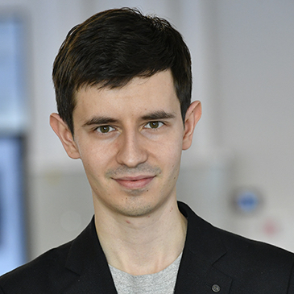
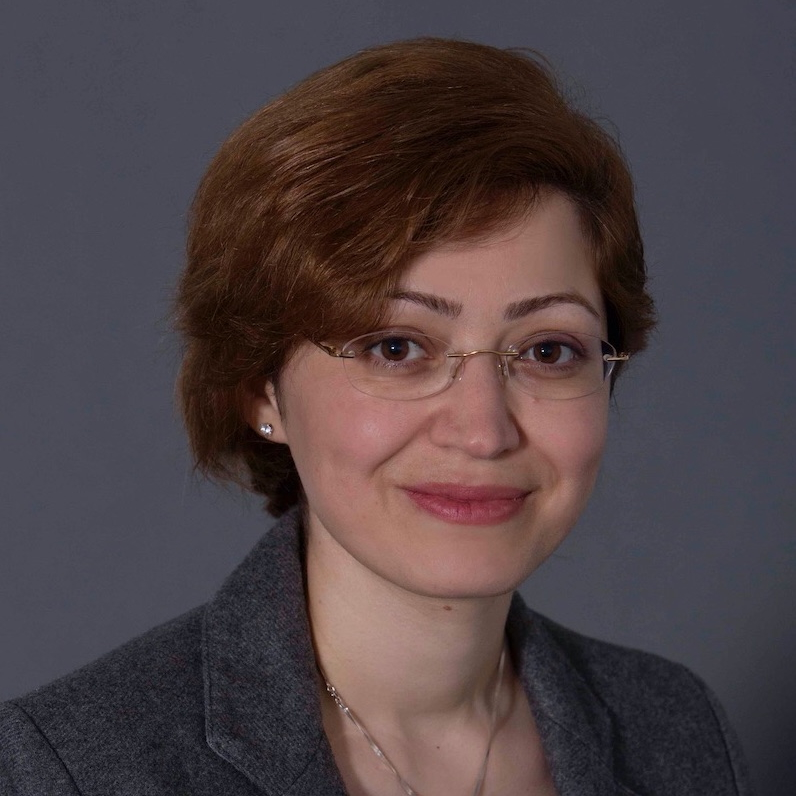

Welcome to the website of the second **UncertaiNLP** workshop to be held at [EMNLP 2025](https://2025.emnlp.org) in Suzhou, China.

*Tagline:* UncertaiNLP brings together researchers embracing sources of uncertainty from human language and NLP tools; harnessing them for improved NLP.

Previous editions of UncertaiNLP: [2024](/2024).

**Update 18/07:** We have extended the submission deadlines and the subsequent review schedule by a week! 

## Important Dates
- **First call for papers:** June 6th, 2025
- **Second call for papers:** July 1st, 2025
- **Third call for papers:** August 1st, 2025
- **Submission deadline:** ~~August 8th, 2025~~ August 15th, 2025
- **Submission of already pre-reviewed ARR papers:** ~~August 22nd, 2025~~ August 29th, 2025
- **Notification of acceptance:** ~~September 10th, 2025~~ September 17th, 2025
- **Camera-ready papers due:** ~~September 14th, 2025~~ September 21st, 2025
- **Workshop date:** November 9th, 2025

All deadlines are 11:59pm UTC-12 ("anywhere on earth"). 

## Workshop Topic and Content

Human languages are inherently ambiguous and understanding language input is subject to interpretation and complex contextual dependencies. Nevertheless, the main body of research in NLP is still based on the 
assumption that ambiguities and other types of underspecification can and have to be resolved. This workshop will provide a platform for research that embraces variability in human language and aims to represent and evaluate the uncertainty that arises from it, and from modeling tools themselves.

### Workshop Topics

UncertaiNLP welcomes submissions to topics related (but not limited) to:

<!-- - *Frameworks for uncertainty representation* -->
- *Formal tools for uncertainty representation*
  - Theoretical work on probability and its generalizations
  - Symbolic representations of uncertainty

- *Documenting sources of uncertainty*
  - Theoretical underpinnings of linguistic sources of variation
  - Data collection (e.g., to document linguistic variability, multiple perspectives, etc.)
 
- *Modeling*
  - Explicit representation of model uncertainty (e.g., parameter and/or hypothesis uncertainty, Bayesian NNs in NLU/NLG, verbalised uncertainty, feature density, external calibration modules)
  - Disentangled representation of different sources of uncertainty (e.g., hierarchical models, prompting)
  - Reducing uncertainty due to additional context (e.g. clarification questions, retrieval/API augmented models)

- *Learning (or parameter estimation)*
  - Learning from single and/or multiple references
  - Gradient estimation in latent variable models
 
- *Probabilistic inference*
  - Theoretical and applied work on approximate inference (e.g., variational inference, Langevin dynamics)
  - Unbiased and asymptotically unbiased sampling algorithms
 
- *Decision making*
  - Utility-aware decoders and controllable generation
  - Selective prediction
  - Active learning

- *Evaluation*
  - Statistical evaluation of language models
  - Calibration to interpretable notions of uncertainty (e.g., calibration error, conformal prediction)
  - Evaluation of epistemic uncertainty

- *Hallucinations*
  - Theoretical and empirical study of hallucination phenomena in NLU/NLG
  - Describing, formalising, categorising hallucination phenomena  
  - Methods for detecting and quantifying hallucinations
  - Mitigation techniques including uncertainty-aware generation, retrieval-augmented methods, and controllable generation
  - Relationship between specific kinds (or sources) of uncertainty and hallucination occurrence

### Workshop Schedule 

The workshop will take place November 9th, 2025 in room A207 at the [Suzhou International Expo Centre](https://maps.app.goo.gl/WHQDmNgRvGdcECv47). The detailed program is available [here](/program) and an overview of the schedule is given below:

- 09:00 - 09:10: Opening remarks
- 09:10 - 09:55: Invited Talk - Maxim Panov
  - Title: *Uncertainty Quantification for Generative Language Models*
- 09:55 - 10:30: Poster lightning round 1 (in-person presenters)
- 10:30 - 11:00: Coffee Break
- 11:00 - 12:15: In-person poster session
- 12:15 - 13:15: Lunch break
- 13:15 - 14:00: Invited Talk - Parisa Kordjamshidi
  - Title: *Reasoning under Uncertainty with Large Multimodal Language Models*
- 14:00 - 14:45: Poster lightning round 2 (virtual presenters)
- 14:45 - 15:30: Invited Talk - Gal Yona
  - Title: *Beyond Factuality: Improving Trust and Reliablility of Large Language Models*
- 15:30 - 16:00: Coffee Break
- 16:00 - 16:45: Invited Talk - Eyke Hüllermeier
  - Title: *Challenges in Uncertainty Quantification for Large Language Models*
- 16:45 - 17:00: Closing remarks

 
<table cellspacing="0" cellpadding="0" class="speakers">
  <tr>
    <td></td>
    <td></td>
    <td></td>  
    <td></td>
  </tr>
  <tr>
    <td><figcaption>Gal Yona (Google Research, IL)</figcaption> </td>
    <td><figcaption>Maxim Panov (MBZUAI, UAE)</figcaption> </td>
    <td><figcaption>Parisa Kordjamshidi (Michigan State University, USA)</figcaption></td>
    <td><figcaption>Eyke Hüllermeier (LMU Münich, DE)</figcaption> </td>
  </tr>
</table>

**Gal Yona** is a Research Scientist at Google Research, Tel Aviv, where she is working on improving factuality in large language models, with an emphasis on robustness and uncertainty. Before joining Google, Gal completed her PhD in Computer Science at the Weizmann Institute of Science, developing definitions and algorithms for preventing discrimination in machine learning models. Gal received numerous award during her PhD, including the Google PhD Fellowship in Machine Learning (2021).

**Maxim Panov** is an Assistant Professor at MBZUAI, UAE. Before joining MBZUAI, Panov worked as a research scientist at DATADVANCE Company, where he participated in developing a library of data analysis methods for engineering applications. This library, pSeven, is now used by many companies worldwide, including Airbus, Porsche, Mitsubishi, Toyota, and Limagrain. From 2018, Panov has been an assistant professor at Skolkovo Institute of Science and Technology, Moscow, where he led a statistical machine learning group. Since 2022, he has led an AI theory and algorithms group at the Technology Innovation Institute, Abu Dhabi, UAE. His research interests lie in uncertainty quantification for machine learning model predictions and Bayesian approaches in machine learning. Maxim is leading a research team dedicated to exploring the theoretical foundations of uncertainty quantification and its practical applications. Maxim is also co-leading the development of the LM-Polygraph framework for uncertainty quantification for LLMs. Maxim was a local chair for the ICDM 2024 conference and a recipient of the Best Paper Runner-up Award at the Uncertainty in Artificial Intelligence 2023 conference.

**Parisa Kordjamshidi** is an Associate Professor of Computer Science and Engineering at Michigan State University. Her research focuses on Natural Language Processing, multimodal reasoning across vision and language, and neuro-symbolic learning. She received her Ph.D. from KU Leuven and conducted postdoctoral research at the University of Illinois Urbana-Champaign. She is a recipient of the NSF CAREER, Amazon Faculty Research, and Fulbright Scholar Awards, and her research team received the NAACL 2025 Outstanding Research Paper Award. Dr. Kordjamshidi serves as Associate Editor of JAIR,  Co-editor in chief of  ARR (2026), Action Editor for TACL and  has held  roles in organization committee of major conferences including ACL, NAACL, EACL, EMNLP, ECML-PKDD, and AAAI. Currently, she is a visiting Associate Professor at UCLA spending a part of her sabbatical.

**Eyke Hüllermeier** is a full professor at the Institute of Informatics at LMU Munich, Germany, where he holds the Chair of Artificial Intelligence and Machine Learning. He studied mathematics and business computing, received his PhD in Computer Science from Paderborn University in 1997, and a Habilitation degree in 2002. Before joining LMU, he held professorships at several other German universities (Dortmund, Magdeburg, Marburg, Paderborn) and spent two years as a Marie Curie fellow at the IRIT in Toulouse (France). His research interests are centered around methods and theoretical foundations of artificial intelligence, with a particular focus on machine learning, preference modeling, and reasoning under uncertainty. He has published more than 400 articles on related topics in top-tier journals and major international conferences, and several of his contributions have been recognized with scientific awards. Professor Hüllermeier is Editor-in-Chief of Data Mining and Knowledge Discovery, Associate Editor of the IEEE Transactions on Pattern Analysis and Machine Intelligence (TPAMI), and serves on the editorial boards of several other AI and machine learning journals. He is currently also the president of EuADS, the European Association for Data Science.

## Call for Papers
Authors are invited to submit by August 15th original and unpublished research papers in the following categories:

- Full papers (up to 8 pages) for substantial contributions.
- Short papers (up to 4 pages) for ongoing or preliminary work.

All submissions must be in PDF format, submitted electronically via [OpenReview](https://openreview.net/group?id=EMNLP/2025/Workshop/UncertaiNLP) and should follow the EMNLP 2025 formatting guidelines (following the [ARR CfP](https://aclrollingreview.org/cfp): use the official ACL style templates, which are available [here](https://github.com/acl-org/acl-style-files)).

We now accept submissions with already existing ACL Rolling Reviews (ARR) via [OpenReview](https://openreview.net/group?id=EMNLP/2025/Workshop/UncertaiNLP_ARR_Commitment), with the deadline August 29th AoE. These submissions must have been reviewed by ARR before, which will be used in our evaluation, and which must be linked to our system through the **paper link** field available in the OpenReview form. Please make sure to also follow the EMNLP 2025 formatting guidelines (following the [ARR CfP](https://aclrollingreview.org/cfp): use the official ACL style templates, which are available [here](https://github.com/acl-org/acl-style-files)).

All submissions are archival, but we also invite authors of papers accepted to Findings to reach out to the organizing committee of UncertaiNLP to present their papers at the workshop, if in line with the topics described above.

Camera-ready versions for accepted archival papers should be uploaded to the submission system by the camera-ready deadline. Authors may use up to one (1) additional page to address reviewer comments.

Call for Papers is available [here](/cfp).

## Program Committee
- Luigi Acerbi (University of Helsinki)
- Roee Aharoni (Google Research)
- Alessandro Antonucci (IDSIA)
- Henri Aïdasso (Université du Québec)
- Samuel Barry (Mistral AI)
- Nitay Calderon (Technion)
- Juan Cardenas-Cartagena (University of Groningen)
- Arie Cattan (Bar Ilan University)
- Julius Cheng (University of Cambridge)
- Ye-eun Cho (Sungkyunkwan University)
- Caio Corro (INSA Rennes)
- Nico Daheim (Technische Universität Darmstadt)
- Sarkar Snigdha Sarathi Das (Pennsylvania State University)
- Vivek Datla (Capital One)
- Bonaventure F. P. Dossou (McGill University)
- Adam Faulkner (Capital One)
- Pedro Lobato Ferreira (University of Amsterdam)
- Antske Fokkens (VU University Amsterdam)
- Jes Frellsen (Technical University of Denmark)
- Thomas L. Griffiths (Princeton University)
- Georg Groh (Technical University Munich)
- Christian Hardmeier (IT University Copenhagen)
- Zhiqi Huang (CapitalOne)
- Evgenia Ilia (University of Amsterdam)
- Yuu Jinnai (CyberAgent, Inc.)
- Mucheol Kim (Chung-Ang University)
- Deepak Kumar (Infrrd)
- Lucie Kunitomo-Jacquin (AIST)
- Haau-Sing Li (Technische Universität Darmstadt)
- Edison Marrese-Taylor (University of Tokyo)
- Yan Meng (University of Amsterdam)
- Timothee Mickus (University of Helsinki)
- Tatiana Passali (Aristotle University of Thessaloniki)
- Laura Perez-Beltrachini (University of Edinburgh)
- Yuval Pinter (Ben-Gurion University of the Negev)
- Timothy Pistotti (University of Auckland)
- Alberto Purpura (CapitalOne)
- Julian Rodemann (LMU Munich)
- Rico Sennrich (University of Zürich)
- Arnab Sharma (Paderborn University)
- Anthony Sicilia (Northeastern University)
- Edwin Simpson (University of Bristol)
- Maciej Skorski (University of Warsaw)
- Sharmin Sultana (University of Massachusetts at Lowell)
- Aarne Talman (University of Helsinki)
- Sergey Troshin (University of Amsterdam)
- Grigorios Tsoumakas (Aristotle University of Thessaloniki)
- Dennis Ulmer (University of Amsterdam)
- Teemu Vahtola (University of Helsinki)
- Matias Valdenegro-Toro (University of Groningen)
- Sami Virpioja (University of Helsinki)
- Daniel Vollmers (Paderborn University)
- Ryan Wails (Georgetown University)
- Li Wang (CapitalOne)
- Di Wu (University of Amsterdam)
- Yusen Zhang (Pennsylvania State University)

<!--- ## Workshop Organizers -->

<table class="organizer-table" cellspacing="0" cellpadding="0">
  <tr>
    <td></td>
    <td></td>
    <td></td>
    <td></td>
    <td></td>
  </tr>
  <tr>
    <td><figcaption><a href="https://wilkeraziz.github.io/">Wilker Aziz, University of Amsterdam</a></figcaption></td>
    <td><figcaption><a href="https://www.cs.tau.ac.il/~joberant/">Jonathan Berant, Tel Aviv University and Google Deepmind</a></figcaption></td>
    <td><figcaption><a href="https://bryaneikema.com">Bryan Eikema, University of Amsterdam</a></figcaption></td>
    <td><figcaption><a href="https://cental.uclouvain.be/team/mcdm/">Marie-Catherine de Marneffe, UCLouvain and FNRS</a></figcaption></td>
    <td><figcaption><a href="https://bplank.github.io/">Barbara Plank, LMU Münich and IT University of Copenhagen</a></figcaption></td>
  </tr>
</table>
<table class="organizer-table" cellspacing="0" cellpadding="0" style="margin-top: 20px">
  <tr>
    <td></td>
    <td></td>
    <td></td>
    <td></td>
    <td></td>
  </tr>
  <tr>
    <td><figcaption><a href="https://scholar.google.ru/citations?user=-zFR1g0AAAAJ">Artem Shelmanov, Mohamed bin Zayed University of Artificial Intelligence</a></figcaption></td>
    <td><figcaption><a href="https://swabhs.com/">Swabha Swayamdipta, USC Viterbi CS</a></figcaption></td>
    <td><figcaption><a href="https://blogs.helsinki.fi/tiedeman/">Jörg Tiedemann, University of Helsinki</a></figcaption></td>
    <td><figcaption><a href="https://jrvc.github.io">Raúl Vázquez University of Helsinki</a></figcaption></td>
    <td><figcaption><a href="https://scholar.google.com/citations?user=S5NGkFsAAAAJ">Chrysoula Zerva, Instituto de Telecomunicaçõ es</a></figcaption></td>
  </tr>
</table>

## Contact
You can contact the organizers by email to [uncertainlp@googlegroups.com](mailto:uncertainlp@googlegroups.com).

## Sponsors
We would like to thank [UTTER](https://he-utter.eu), [CRAI](https://centerforresponsible.ai) and Google (via a Google research scholar award) for their support of this workshop.
<table class="sponsor-table" cellspacing="0" cellpadding="0" style="margin-top: 20px;">
  <tr>
    <td></td>
    <td></td>
    <td></td>
  </tr>
</table>

## Anti-Harassment Policy
UncertaiNLP workshop adheres to the [ACL’s code of ethics](https://www.aclweb.org/portal/content/acl-code-ethics), [ACL’s anti-harassment 
policy](https://www.aclweb.org/adminwiki/index.php?title=Anti-Harassment_Policy) , and [ACL’s code of conduct](https://2024.eacl.org/code/). 

## Image Credits

Images were created using text-to-image model supplied via [getimg.ai/](https://getimg.ai/text-to-image), using the [CreativeML Open Rail-M license](https://huggingface.co/spaces/CompVis/stable-diffusion-license).
