Welcome to the website of the second **UncertaiNLP** workshop to be held at [EMNLP 2026](https://2026.emnlp.org) in Budapest, Hungary.

*Tagline:* UncertaiNLP brings together researchers studying uncertainty in human language and NLP tools, including LLMs, and how it can be harnessed to improve NLP.

Previous editions of UncertaiNLP: [2024](/2024), [2025](/2025).

## Important Dates
- **First call for papers:** TBD
- **Second call for papers:** TBD
- **Third call for papers:** TBD
- **Submission deadline:** TBD
- **Submission of already pre-reviewed ARR papers:** TBD
- **Notification of acceptance:** TBD
- **Camera-ready papers due:** TBD
- **Workshop date:** October 24 - 29, 2026 (workshop date TBD)

All deadlines are 11:59pm UTC-12 ("anywhere on earth"). 

## Workshop Topic and Content

Human languages are inherently ambiguous, and understanding language input is subject to interpretation and complex contextual dependencies. Nevertheless, the main body of research in NLP is still based on the assumption that ambiguities and other types of underspecification can and have to be resolved. This workshop will provide a platform for research that embraces variability in human language and aims to represent and evaluate the uncertainty that arises from it and the modeling tools themselves.

### Workshop Topics

UncertaiNLP welcomes submissions to topics related (but not limited) to:

<!-- - *Frameworks for uncertainty representation* -->
- *Formal tools for uncertainty representation*
  - Theoretical work on probability and its generalizations
  - Symbolic representations of uncertainty

- *Documenting sources of uncertainty*
  - Theoretical underpinnings of linguistic sources of variation
  - Data collection (e.g., to document linguistic variability, multiple perspectives, etc.)
 
- *Modeling*
  - Explicit representation of model uncertainty (e.g., parameter and/or hypothesis uncertainty, Bayesian NNs in NLU/NLG, verbalised uncertainty, feature density, external calibration modules)
  - Disentangled representation of different sources of uncertainty (e.g., hierarchical models, prompting)
  - Reducing uncertainty due to additional context (e.g. clarification questions, retrieval/API augmented models)

- *Learning (or parameter estimation)*
  - Learning from single and/or multiple references
  - Gradient estimation in latent variable models
 
- *Probabilistic inference*
  - Theoretical and applied work on approximate inference (e.g., variational inference, Langevin dynamics)
  - Unbiased and asymptotically unbiased sampling algorithms
 
- *Decision making*
  - Utility-aware decoders and controllable generation
  - Selective prediction
  - Active learning

- *Evaluation*
  - Statistical evaluation of language models
  - Calibration to interpretable notions of uncertainty (e.g., calibration error, conformal prediction)
  - Evaluation of epistemic uncertainty

- *Hallucinations*
  - Theoretical and empirical study of hallucination phenomena in NLU/NLG
  - Describing, formalising, categorising hallucination phenomena  
  - Methods for detecting and quantifying hallucinations
  - Mitigation techniques including uncertainty-aware generation, retrieval-augmented methods, and controllable generation
  - Relationship between specific kinds (or sources) of uncertainty and hallucination occurrence

### Workshop Schedule 

TBD

 
<table cellspacing="0" cellpadding="0" class="speakers">
  <tr>
    <td>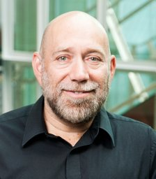</td>
    <td>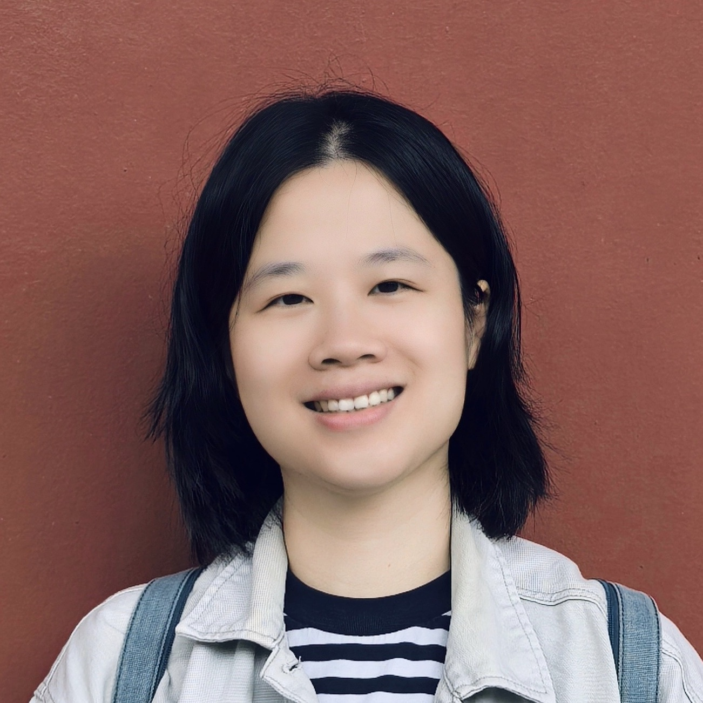</td>
    <td>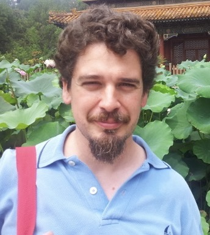</td>  
    <td>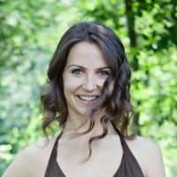</td>
  </tr>
  <tr>
    <td><figcaption>Dan Roth (University of Pennsylvania, USA)</figcaption> </td>
    <td><figcaption>Yingzhen Li (Imperial College London, UK)</figcaption> </td>
    <td><figcaption>André Martins (Instituto Superior Técnico, PT)</figcaption></td>
    <td><figcaption>Gintare Karolina Dziugaite (Google DeepMind, CAN)</figcaption> </td>
  </tr>
</table>

**Dan Roth** is the Eduardo D. Glandt Distinguished Professor at the University of Pennsylvania and Chief AI Scientist at Oracle. Until June 2024, Dan served as VP and Distinguished Scientist at AWS AI, where he led the scientific effort behind Amazon's first-generation GenAI products, including Titan Models, Amazon Q, and Amazon Bedrock. His research focuses on the computational foundations of intelligent behavior, spanning machine learning, natural language understanding, knowledge representation and reasoning, and learning theory. He is particularly known for his work on constrained conditional models, integer linear programming formulations for joint learning and inference, and the notion of incidental supervision. Dan is a Fellow of the AAAS, ACM, AAAI, and ACL, and a recipient of the IJCAI John McCarthy Award for major conceptual and theoretical advances in the modeling of natural language understanding, machine learning, and reasoning. He served as Editor-in-Chief of the Journal of Artificial Intelligence Research (JAIR) and has chaired major conferences in his research areas. He received his B.A. Summa cum laude in Mathematics from the Technion, Israel, and his Ph.D. in Computer Science from Harvard University in 1995.

**Yingzhen Li** is an Associate Professor in Machine Learning at the Department of Computing, Imperial College London, and a Turing Fellow at the Alan Turing Institute (since March 2024). Her research focuses on building reliable machine learning systems through probabilistic modelling and representation learning, with topics including deep probabilistic graphical model design, fast and accurate Bayesian inference, uncertainty quantification, and robust and adaptive machine learning. Before returning to academia, she spent two and a half years as a Senior Researcher at Microsoft Research Cambridge. She completed her PhD at the University of Cambridge under the supervision of Prof. Richard E. Turner, with a thesis on approximate inference. She has co-organized major events in probabilistic ML, including AABI and AISTATS, and has delivered tutorials at NeurIPS 2020, UAI 2025, and other venues on approximate inference and Bayesian neural networks.

**André Martins** is an Associate Professor at Instituto Superior Técnico (in both the Computer Science and Electrical and Computer Engineering departments), VP of AI Research at Unbabel, and Senior Researcher at the Instituto de Telecomunicações, where he leads the SARDINE Lab. His research interests span natural language processing and machine learning, with a particular focus on sparse and structured transformations, uncertainty quantification, interpretability, and multimodal processing applied to machine translation, natural language generation, quality estimation, and evaluation. He completed his PhD in the joint CMU–Portugal program in Language Technologies, working at Carnegie Mellon University and Instituto Superior Técnico. His research has been funded by two European Research Council grants — a Starting Grant (DeepSPIN) and a Consolidator Grant (DECOLLAGE). He received multiple best paper awards at ACL conferences, won the WMT 2024 General Translation shared task (achieving the best results in 8 out of 11 languages), and received the IBM Scientific Prize for his work on structured prediction. He is a Fellow of the ELLIS society, co-director of the ELLIS Program in Natural Language Processing, a member of the Lisbon Academy of Sciences, and Program Co-Chair of ACL 2024. He co-founded and co-organizes the Lisbon Machine Learning School (LxMLS).

**Gintare Karolina Dziugaite** is a Senior Research Scientist at Google Brain, based in Toronto, Canada, an Adjunct Professor in the School of Computer Science at McGill University, and an Associate Industry Member of Mila, the Quebec AI Institute. Her research combines theoretical and empirical approaches to understanding deep learning, with a focus on generalization, network compression, and statistical learning theory. Prior to joining Google, she led the Trustworthy AI program at Element AI / ServiceNow. She obtained her PhD in machine learning from the University of Cambridge under the supervision of Zoubin Ghahramani, and holds a Masters of Advanced Study in Applied Mathematics, also from Cambridge. She was a member of the Institute for Advanced Study in Princeton (2020) during the Special Year on Optimization, Statistics, and Theoretical Machine Learning, and has twice been a long-term participant at the Simons Institute for the Theory of Computing at UC Berkeley, in the Foundations of Machine Learning (2017) and Foundations of Deep Learning (2019) programs.

## Call for Papers
Authors are invited to submit by TBD original and unpublished research papers in the following categories:

- Full papers (up to 8 pages) for substantial contributions.
- Short papers (up to 4 pages) for ongoing or preliminary work.

All submissions must be in PDF format, submitted electronically via [OpenReview](https://openreview.net/group?id=EMNLP/2026/Workshop/UncertaiNLP) and should follow the EMNLP 2026 formatting guidelines (following the [ARR CfP](https://aclrollingreview.org/cfp): use the official ACL style templates, which are available [here](https://github.com/acl-org/acl-style-files)).

We now accept submissions with already existing ACL Rolling Reviews (ARR) via [OpenReview](https://openreview.net/group?id=EMNLP/2026/Workshop/UncertaiNLP_ARR_Commitment), with the deadline TBD. These submissions must have been reviewed by ARR before, which will be used in our evaluation, and which must be linked to our system through the **paper link** field available in the OpenReview form. Please make sure to also follow the EMNLP 2026 formatting guidelines (following the [ARR CfP](https://aclrollingreview.org/cfp): use the official ACL style templates, which are available [here](https://github.com/acl-org/acl-style-files)).

All submissions are archival, but we also invite authors of papers accepted to Findings to reach out to the organizing committee of UncertaiNLP to present their papers at the workshop, if in line with the topics described above.

Camera-ready versions for accepted archival papers should be uploaded to the submission system by the camera-ready deadline. Authors may use up to one (1) additional page to address reviewer comments.

Call for Papers is available [here](/cfp).

## Program Committee
- Luigi Acerbi (University of Helsinki, FI)
- Nitay Calderon (Technion, IL)
- Julius Cheng (University of Cambridge, UK)
- Ye-eun Cho (Sungkyunkwan University, KR)
- Caio Corro (INSA Rennes, FR)
- Sarkar Snigdha Sarathi Das (Pennsylvania State University, US)
- Vivek Datla (Capital One, US)
- Bonaventure Dossou (McGill University, CA)
- Adam Faulkner (Capital One, US)
- Pedro Ferreira (University of Amsterdam, NL)
- Jes Frellsen (TU Denmark, DK)
- Yuu Jinnai (CyberAgent Inc., JP)
- Lucie Kunitomo-Jacquin (AIST, JP)
- Gleb Kuzmin (RUDN University, RU)
- Yunho Maeng (Ewha Womans University, KR)
- Yan Meng (University of Amsterdam, NL)
- Timothee Mickus (University of Helsinki, FI)
- Tatiana Passali (Aristotle U. of Thessaloniki, GR)
- Laura Perez-Beltrachini (University of Edinburgh, UK)
- Yuval Pinter (Ben-Gurion University of the Negev, IL)
- Timothy Pistotti (University of Auckland, NZ)
- Alberto Purpura (Capital One, US)
- Julian Rodemann (LMU Munich, DE)
- Lyudmila Rvanova (Sirius University, RU)
- Arnab Sharma (University of Paderborn, DE)
- Anthony Sicilia (West Virginia University, US)
- Edwin Simpson (University of Bristol, UK)
- Maciej Skórski (University of Warsaw, PL)
- Sergey Troshin (University of Amsterdam, NL)
- Grigorios Tsoumakas (Aristotle University of Thessaloniki, GR)
- Teemu Vahtola (University of Helsinki, FI)
- Matias Valdenegro (Univ. of Groningen, NL)
- Sami Virpioja (University of Helsinki, FI)
- Christian Hardmeier (IT University of Copenhagen, DK)
- Samuel Barry (Mistral AI, US)
- Dennis Ulmer (University of Amsterdam, NL)
- Rico Sennrich (University of Zurich, CH)
- Oscar Lithgow Serrano (IDSIA, CH)
- Haau-Sing Li (TU Darmstadt, DE)
- Nico Daheim (TU Darmstadt, DE)
- Wataru Hashimoto (NAIST, JP)
- Alessandro Antonucci (IDSIA, CH)

<!--- ## Workshop Organizers -->
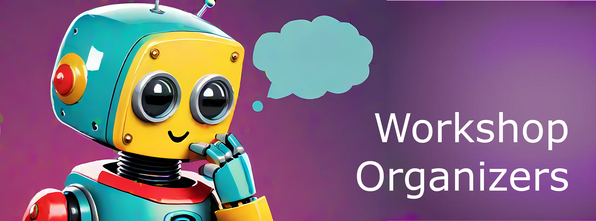

<table class="organizer-table" cellspacing="0" cellpadding="0">
  <tr>
    <td>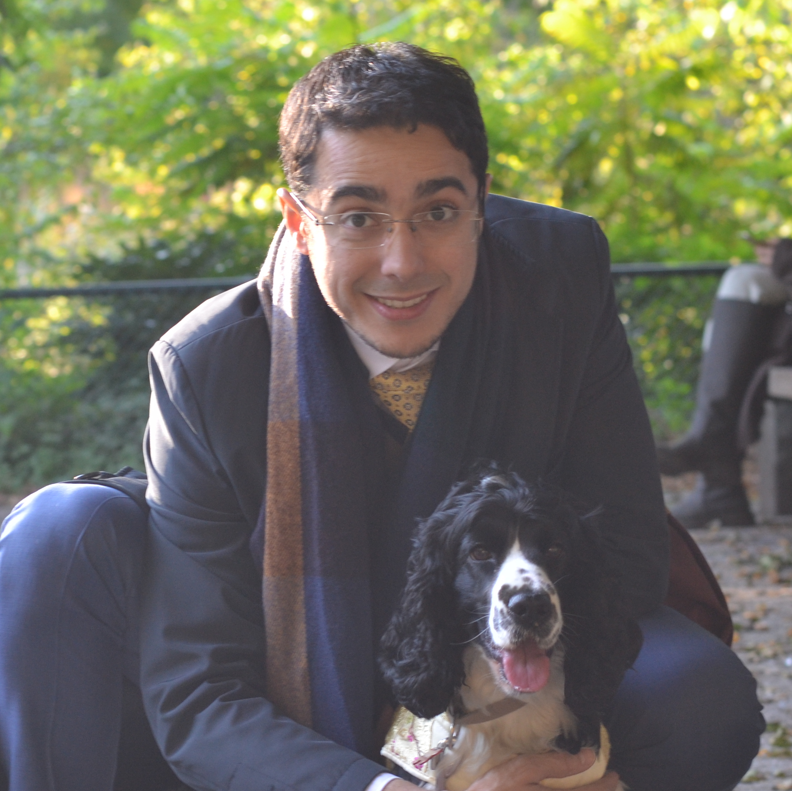</td>
    <td>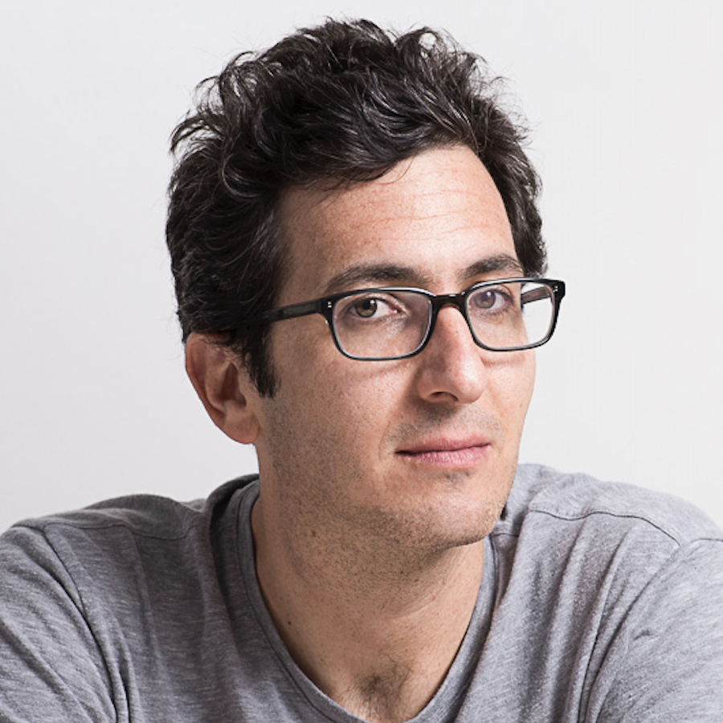</td>
    <td>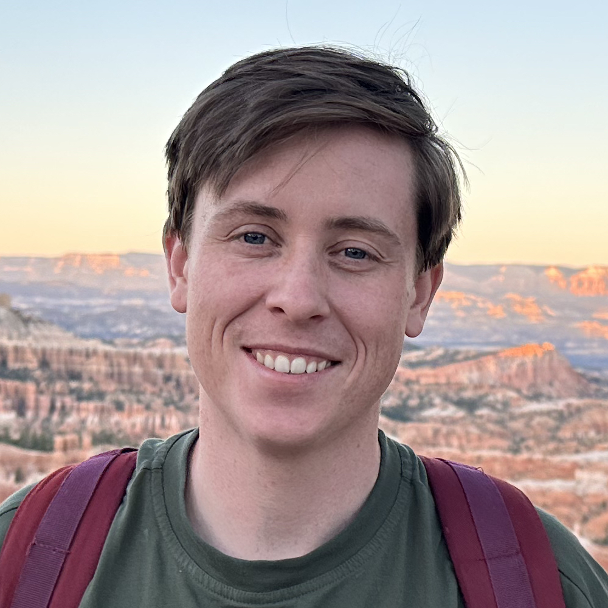</td>
    <td>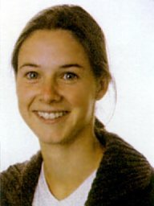</td>
    <td>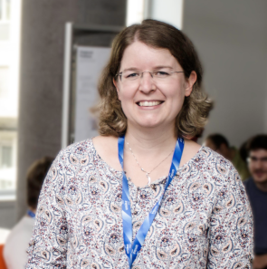</td>
  </tr>
  <tr>
    <td><figcaption><a href="https://wilkeraziz.github.io/">Wilker Aziz, University of Amsterdam</a></figcaption></td>
    <td><figcaption><a href="https://www.cs.tau.ac.il/~joberant/">Jonathan Berant, Tel Aviv University and Google Deepmind</a></figcaption></td>
    <td><figcaption><a href="https://bryaneikema.com">Bryan Eikema, University of Amsterdam</a></figcaption></td>
    <td><figcaption><a href="https://cental.uclouvain.be/team/mcdm/">Marie-Catherine de Marneffe, UCLouvain and FNRS</a></figcaption></td>
    <td><figcaption><a href="https://bplank.github.io/">Barbara Plank, LMU Münich and IT University of Copenhagen</a></figcaption></td>
  </tr>
</table>
<table class="organizer-table" cellspacing="0" cellpadding="0" style="margin-top: 20px">
  <tr>
    <td>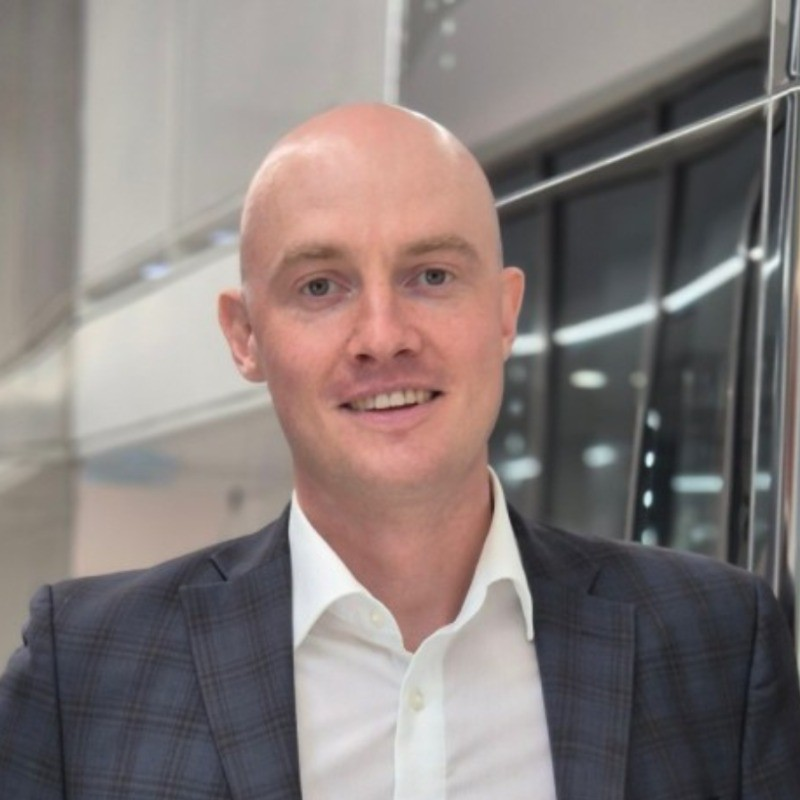</td>
    <td>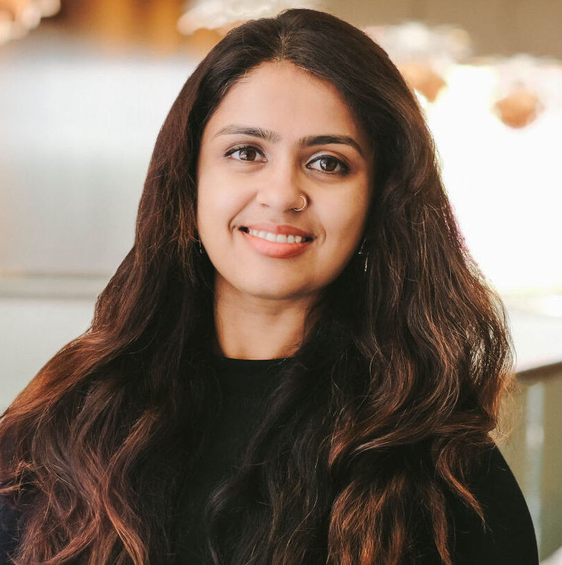</td>
    <td>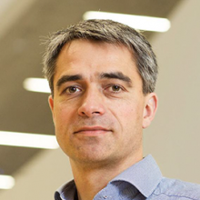</td>
    <td></td>
    <td>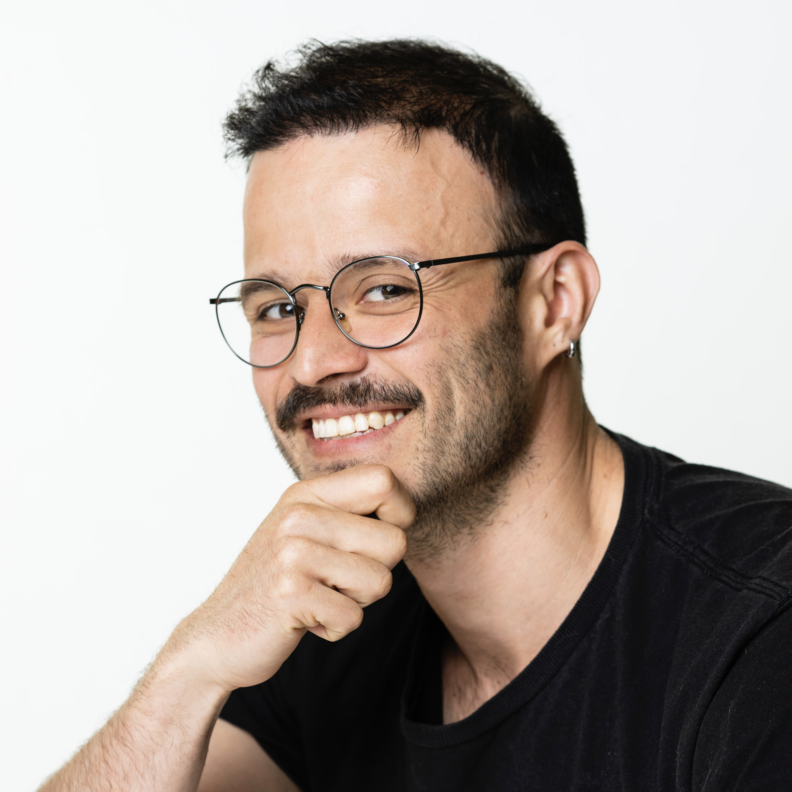</td>
    <td>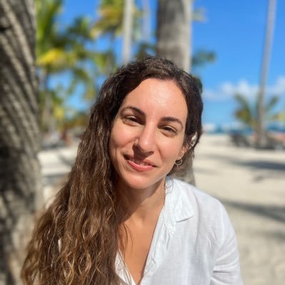</td>
  </tr>
  <tr>
    <td><figcaption><a href="https://iinemo.github.io/">Artem Shelmanov, Mohamed bin Zayed University of Artificial Intelligence</a></figcaption></td>
    <td><figcaption><a href="https://swabhs.com/">Swabha Swayamdipta, USC Viterbi CS</a></figcaption></td>
    <td><figcaption><a href="https://blogs.helsinki.fi/tiedeman/">Jörg Tiedemann, University of Helsinki</a></figcaption></td>
    <td><figcaption><a href="https://scholar.google.com/citations?user=jWmgVhMAAAAJ">Artem Vazhentsev, Mohamed bin Zayed University of Artificial Intelligence</a></figcaption></td>
    <td><figcaption><a href="https://jrvc.github.io/">Raúl Vázquez University of Helsinki</a></figcaption></td>
    <td><figcaption><a href="https://scholar.google.com/citations?user=S5NGkFsAAAAJ">Chrysoula Zerva, Instituto de Telecomunicaçõ es</a></figcaption></td>
  </tr>
</table>

## Contact
You can contact the organizers by email to [uncertainlp@googlegroups.com](mailto:uncertainlp@googlegroups.com).

## Sponsors
We would like to thank [MCML (the Munich Center for Machine Learning)](https://www.mcml.ai) and co-organisers' project funding for their support of this workshop.
<table class="sponsor-table" cellspacing="0" cellpadding="0" style="margin-top: 20px;">
  <tr>
    <td><a href="https://www.mcml.ai">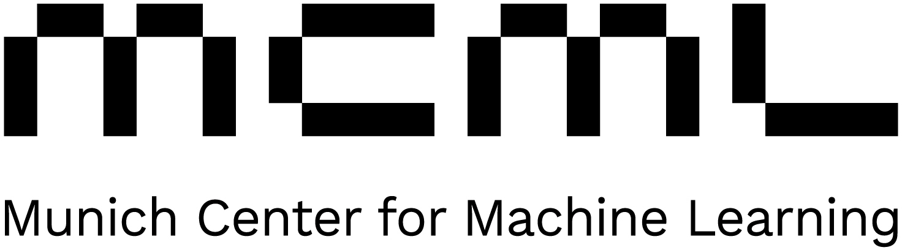</a></td>
  </tr>
</table>

## Anti-Harassment Policy
UncertaiNLP workshop adheres to the [ACL’s code of ethics](https://www.aclweb.org/portal/content/acl-code-ethics) and [ACL’s anti-harassment policy](https://www.aclweb.org/adminwiki/index.php?title=Anti-Harassment_Policy).

## Image Credits

Images were created using text-to-image model supplied via [getimg.ai/](https://getimg.ai/text-to-image), using the [CreativeML Open Rail-M license](https://huggingface.co/spaces/CompVis/stable-diffusion-license).
