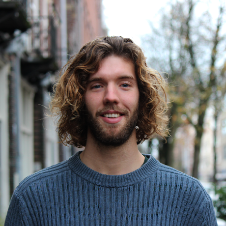
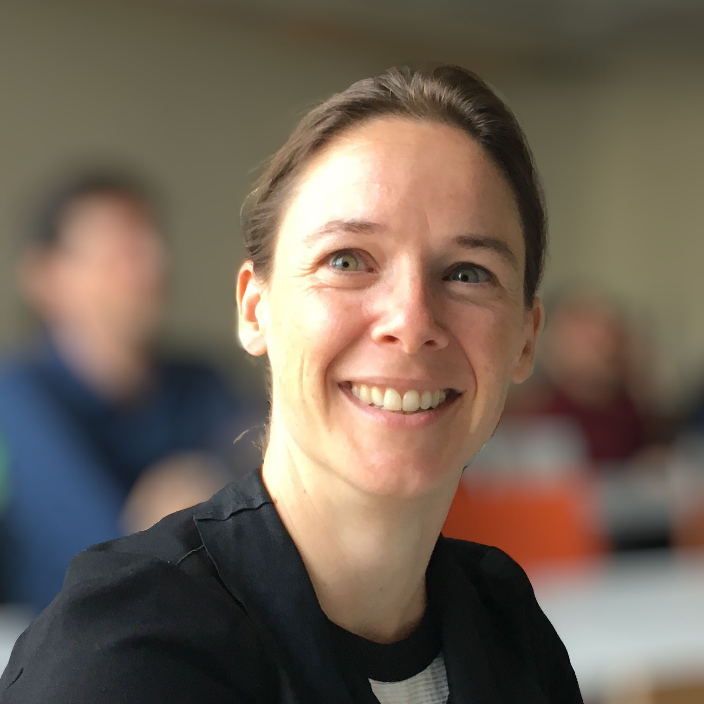
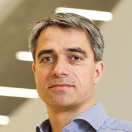

<!-- # First Workshop on Uncertainty-Aware NLP @EACL 2024 -->

Welcome to the website of the **UncertaiNLP** workshop to be held at [EACL 2024 in Malta](https://2024.eacl.org/).

*Tagline:* UncertaiNLP brings together researchers embracing sources of uncertainty from human language and NLP tools; harnessing them for improved NLP.

*website under construction* 

## Important Dates
- **First call for papers:** October 20, 2023
- **Second call for papers:** November 15, 2023
- **Third call for papers:** December 11 , 2023
- **Submission deadline:** December 18, 2023
<!-- - Direct Submission deadline (pre-reviewed ARR & main conference): January 17, 2024 -->
- **Notification of acceptance:** January 20, 2024
- **Camera-ready papers due:** January 30 2024

All deadlines are 11:59pm UTC-12 ("anywhere on earth").

## Workshop Topic and Content

Human languages are inherently ambiguous and understanding language input is subject to interpretation and complex contextual dependencies. Nevertheless, the main body of research in NLP is still based on the 
assumption that ambiguities and other types of underspecification can and have to be re-solved. This workshop will provide a platform for research that embraces variability in human language and aims to 
represent and evaluate the uncertainty that arises from it, and from modeling tools themselves.

### Workshop Topics

UncertaiNLP welcomes submissions to topics related (but not limited) to:

- *Frameworks for uncertainty representation*
  - Theoretical work on probability and its generalizations
  - Symbolic representations of uncertainty
- *Documenting sources of uncertainty*
  - Theoretical underpinnings of linguistic sources of variation
  - Data collection (e.g., to to document linguistic variability, multiple perspectives, etc.)
 
- *Modeling*
  - Explicit representation of model uncertainty (e.g., parameter and/or hypothesis uncertainty, Bayesian NNs in NLU/NLG, verbalised uncertainty, feature density, external calibration modules)
  - Disentangled representation of different sources of uncertainty (e.g., hierarchical models, prompting)
  - Reducing uncertainty due to additional context (e.g., additional context, clarification questions, retrieval/API augmented models)

- *Learning (or parameter estimation)*
  - Learning from single and/or multiple references
  - Gradient estimation in latent variable models
 
- *Probabilistic inference*
  - Theoretical and applied work on approximate inference (e.g., variational inference, Langevin dynamics)
  - Unbiased and asymptotically unbiased sampling algorithms
 
- *Decision making*
  - Utility-aware decoders and controllable generation
  - Selective prediction
  - Active learning
    
- *Evaluation*
  - Statistical evaluation of language models
  - Calibration to interpretable notions of uncertainty (e.g., calibration error, conformal prediction)
  - Evaluation of epistemic uncertainty

 
<!-- ## Invited Speakers -->

<table cellspacing="0" cellpadding="0">
  <tr>
    <td></td>
    <td></td>
    <td></td>
  </tr>
  <tr>
    <td><figcaption font-size=10px word-wrap="break-word" width="360" height="auto">Yarin Gal (tentative; University of Oxford, UK)</figcaption></td>
    <td><figcaption font-size=10px word-wrap="break-word" width="360" height="auto">Kristin Lennox (Exponent, US)</figcaption> </td>
    <td><figcaption font-size=10px word-wrap="break-word" width="360" height="auto">Mohit Bansal (UNC Chapel Hill, US)</figcaption> </td>
  </tr>
</table>

**Yarin Gal** is an Associate Professor of Machine Learning at the University of Oxford Computer Science department, and head of the Oxford Applied and Theoretical Machine Learning Group (OATML). He is also the Tutorial Fellow in Computer Science at Christ Church, Oxford, and Fellow at the Alan Turing Institute, the UK's national institute for data science.

**Kristin Lennox** has more than ten years of experience applying statistics, machine learning, and operations research techniques to scientific and engineering problems. Her expertise includes experimental design, analysis of computer experiments, and risk assessment in high consequence environments. Kristin Lennox's career has included data science applications in aerospace, automotive engineering, chemical engineering, materials science, process engineering, oil and gas, public infrastructure, bioinformatics, software development, and manufacturing. She has worked with many varieties of data ranging from large publicly available datasets to small scale designed experiments and specializes in combining disparate data types and sources to solve complex problems. Dr. Lennox's recent professional experience has focused on design of artificial intelligence (AI) systems intended to act in partnership with people. Since joining Exponent, she has been studying safety benefits of advanced driver assistance systems (ADAS) and automated driving.

**Mohit Bansal** is the John R. & Louise S. Parker Professor and the Director of the MURGe-Lab (UNC-NLP Group) in the Computer Science department at University of North Carolina (UNC) Chapel Hill. Prior to this, he was a research assistant professor (3-year endowed position) at TTI-Chicago. He received his PhD from UC Berkeley in 2013 (where he was advised by Dan Klein) and his BTech from IIT Kanpur in 2008. His research expertise is in natural language processing and multimodal machine learning, with a particular focus on grounded and embodied semantics, language generation and Q&A/dialogue, and interpretable and generalizable deep learning. He is a recipient of IIT Kanpur Young Alumnus Award,  DARPA Director's Fellowship, NSF CAREER Award, Google Focused Research Award, Microsoft Investigator Fellowship, Army Young Investigator Award (YIP), DARPA Young Faculty Award (YFA), and outstanding paper awards at ACL, CVPR, EACL, COLING, and CoNLL. He has been a keynote speaker for the AACL 2023 and INLG 2022 conferences. His service includes ACL Executive Committee, ACM Doctoral Dissertation Award Committee, CoNLL Program Co-Chair, ACL Americas Sponsorship Co-Chair, and Associate/Action Editor for TACL, CL, IEEE/ACM TASLP, and CSL journals.

## Call for Papers
<!---
We will accept submissions through Softconf at: TBA. All submissions should use the EACL 2024 template and formatting requirements specified by ACL.

We welcome submissions for long and short paper submissions, with original and unpublished work. Long papers may consist of up to 8 pages of content + references. Short papers may consist of up to 4 pages of 
content + references. Supplementary material can be added in the appendices section after references. The content, references, and (optional) supplementary material should be the part of the same pdf file. 
Papers in this category will be published in the workshop proceedings of the ACL Anthology, and therefore they cannot be published elsewhere. Submissions in this track should be anonymous. Upon acceptance, 
both types of papers will be given one (1) additional page of content, which may be used for addressing reviewers’ comments in the camera-ready version.

### Camera-ready information
Camera-ready versions for accepted archival papers should be uploaded to the submission system by the camera-ready deadline. Authors may use up to one (1) additional page to address reviewer comments.
-->

## Program Committee
- Luigi Acerbi (University of Helsinki, FI)
- Caio Corro (Université Paris-Saclay, FR)
- Mathias Creutz (University of Helsinki, FI)
- Nico Daheim (TU Darmstadt, DE)
- Greg Durrett (University of Texas, USA)
- Raquel Fernandez (University Amsterdam, NL)
- Adam Fisch (MIT, USA)
- Stella Frank (Copenhagen University, DK)
- Christian Hardmeier (ITU Copenhagen, DK)
- Markus Heinonen (Aalto University, FI)
- Evgenia Ilia (University of Amsterdam, NL)
- Metod Jazbec (University of Amsterdam, NL)
- Robin Jia (USC, USA) 
- Nan-Jiang Jiang (Google, USA)
- Anders Johannsen (Apple, UK)
- Gabriella Lapesa (GESIS, DE)
- Haau-Sing Li (TU Darmstadt, DE)
- Putra Manggala (University of Amsterday, NL)
- Timothee Mickus (University of Helsinki, FI)
- Eric Nalisnick (Johns Hopkins University, USA)
- Philip Schulz (Amazon, AU)
- Tal Schuster (Google Research, USA)
- Djamé Seddah (Inria & Université Paris Sorbonne, FR)
- Rico Sennrich (University of Zurich, CH & University of Edinburgh, UK)
- Natalie Schluter (Apple, DK)
- Sebastian Schuster (Saarland University, DE)
- Edwin Simpson (University of Bristol, UK)
- Anders Søgaard (University of Copenhagen, DK)
- Arno Solin (Aalto University, FI)
- Dharmesh Tailor (University of Amsterdam, NL)
- Aarne Talman (Silo.ai, FI)
- Ivan Titov (University of Edinburgh, UK)
- Teemu Vahtola (University of Helsinki, FI)
- Raúl Vázquez (University of Helsinki, FI)
- Andreas Vlachos (University of Cambridge)
- Sami Virpioja (Utopia Analytics & University of Helsinki, FI)
- Xinpeng Wang (LMU Munich, DE)
- Leon Weber-Genzel (LMU Munich, DE)
- Chrysoula Zerva (Instituto de Telecomunicações & Instituto Superior Técnico, PT)
- Elaine Zosa (Silo.ai, FI)

<!--- ## Workshop Organizers -->

You can reach the organizers by email to [uncertainlp@googlegroups.com](mailto:uncertainlp@googlegroups.com).

<table cellspacing="0" cellpadding="0">
  <tr>
    <td></td>
    <td></td>
    <td></td>
    <td></td>
  </tr>
  <tr>
    <td><figcaption font-size=10px word-wrap="break-word" height="auto"><a href="https://wilkeraziz.github.io/">Wilker Aziz, University of Amsterdam</a></figcaption></td>
    <td><figcaption font-size=10px word-wrap="break-word" height="auto"><a href="https://jorisbaan.nl/">Joris Baan, University of Amsterdam</a></figcaption> </td>
    <td><figcaption font-size=10px word-wrap="break-word" height="auto"><a href="https://researchportal.helsinki.fi/en/persons/hande-celikkanat">Hande Celikkanat, University of Helsinki</a></figcaption> </td>
    <td><figcaption font-size=10px word-wrap="break-word" height="auto"><a href="https://cental.uclouvain.be/team/mcdm/">Marie-Catherine de Marneffe, UCLouvain and FNRS</a></figcaption> </td>
  </tr>
</table>
 
<table cellspacing="0" cellpadding="0">
  <tr>
    <td></td>
    <td></td>
    <td></td>
    <td></td>
  </tr>
  <tr>
    <td><figcaption font-size=10px word-wrap="break-word" height="auto"><a href="https://bplank.github.io/">Barbara Plank, LMU Munich and IT University of Copenhagen</a></figcaption></td>
    <td><figcaption font-size=10px word-wrap="break-word" height="auto"><a href="https://swabhs.com/">Swabha Swayamdipta, USC Viterbi CS</a></figcaption> </td>
    <td><figcaption font-size=10px word-wrap="break-word" height="auto"><a href="https://blogs.helsinki.fi/tiedeman/">Jörg Tiedemann, University of Helsinki</a></figcaption> </td>
    <td><figcaption font-size=10px word-wrap="break-word" height="auto"><a href="https://dennisulmer.eu/">Dennis Ulmer, IT University of Copenhagen</a></figcaption> </td>
  </tr>
</table>

## Anti-Harassment Policy
UncertaiNLP workshop adheres to the [ACL’s code of ethics](https://www.aclweb.org/portal/content/acl-code-ethics), [ACL’s anti-harassment 
policy](https://www.aclweb.org/adminwiki/index.php?title=Anti-Harassment_Policy) , and [ACL’s code of conduct](https://2024.eacl.org/code/). 

## Image Credits

Images were created using text-to-image model supplied via [getimg.ai/](https://getimg.ai/text-to-image), using the [CreativeML Open Rail-M license](https://huggingface.co/spaces/CompVis/stable-diffusion-license).
